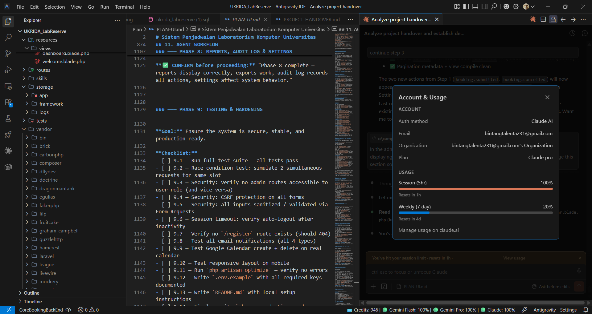

# PLAN-UI — Computer Lab Scheduling System
# Sistem Penjadwalan Laboratorium Komputer Universitas
> Version: 1.0.0 | Status: Planning | Stack: Laravel 11 + MySQL + Blade + Alpine.js + Livewire + Tailwind CSS

---

## TABLE OF CONTENTS

1. [Project Overview](#1-project-overview)
2. [System Architecture](#2-system-architecture)
3. [Entity & Role Definitions](#3-entity--role-definitions)
4. [Database Schema](#4-database-schema)
5. [Feature Modules](#5-feature-modules)
6. [UI/UX Design System](#6-uiux-design-system)
7. [Page Inventory](#7-page-inventory)
8. [Component Library](#8-component-library)
9. [API & Integration Plan](#9-api--integration-plan)
10. [File & Folder Structure](#10-file--folder-structure)
11. [Agent Workflow](#11-agent-workflow)
12. [Rules & Constraints](#12-rules--constraints)
13. [Open Questions (To Confirm)](#13-open-questions-to-confirm)

---

## 1. PROJECT OVERVIEW

### Summary
A web-based computer laboratory scheduling system for a university. The system manages borrowing requests for 1 lab room containing 9 computer units. It supports administrative approval workflows, Google Calendar integration, and audit logging.

### Core Goals
- Prevent double-booking via hard conflict detection
- Provide transparent availability through a shared calendar
- Support a controlled admin approval process
- Track usage statistics for lab management

### Minimum Requirements (Lecturer-Specified)
1. Login system — no public sign-up; only admin creates accounts
2. Separate user page and admin page
3. Users (lecturers/teams) can submit borrowing requests; admin reviews and approves
4. Requests must specify borrowing type: room only, computers only, or full room + computers
5. Requests must be categorized (research, project, practicum, thesis, other)
6. Google Calendar integration
7. Borrowing history view
8. Once approved, the date/time slot is blocked and unavailable

---

## 2. SYSTEM ARCHITECTURE

```
┌─────────────────────────────────────────────────────────────┐
│                        CLIENT LAYER                         │
│          Browser → Blade Templates + Alpine.js              │
│          Livewire for reactive components                    │
└────────────────────────┬────────────────────────────────────┘
                         │ HTTP / WebSocket (Livewire)
┌────────────────────────▼────────────────────────────────────┐
│                    LARAVEL 11 APP                            │
│  ┌──────────┐  ┌──────────┐  ┌──────────┐  ┌────────────┐  │
│  │   Auth   │  │   HTTP   │  │ Livewire │  │  Console   │  │
│  │  Guard   │  │Controllers│  │Components│  │ Commands   │  │
│  └──────────┘  └──────────┘  └──────────┘  └────────────┘  │
│  ┌──────────┐  ┌──────────┐  ┌──────────┐  ┌────────────┐  │
│  │ Services │  │  Models  │  │ Policies │  │   Jobs     │  │
│  │  Layer   │  │(Eloquent)│  │ & Gates  │  │  (Queue)   │  │
│  └──────────┘  └──────────┘  └──────────┘  └────────────┘  │
└──────┬──────────────────────────────┬───────────────────────┘
       │                              │
┌──────▼──────┐              ┌────────▼──────────────────────┐
│   MySQL DB  │              │      External Services        │
│  (Primary)  │              │  ┌────────────────────────┐   │
│             │              │  │  Google Calendar API   │   │
│  InnoDB     │              │  └────────────────────────┘   │
│  Transactions│             │  ┌────────────────────────┐   │
│  for race   │              │  │  SMTP Mail (Notif)     │   │
│  condition  │              │  └────────────────────────┘   │
└─────────────┘              └───────────────────────────────┘
```

### Tech Stack Decisions

| Layer | Technology | Rationale |
|---|---|---|
| Backend Framework | Laravel 11 | Robust, well-documented, excellent ORM & queue system |
| Frontend Rendering | Blade + Livewire 3 | Server-driven UI, no separate SPA build pipeline |
| JS Interactivity | Alpine.js | Lightweight, pairs perfectly with Livewire |
| CSS Framework | Tailwind CSS v3 | Utility-first, AI agent friendly, easy customization |
| Database | MySQL 8.x (InnoDB) | Relational, ACID-compliant, handles race conditions via transactions |
| Auth | Laravel Breeze (custom) | Custom 2-step login, no registration route |
| Calendar Integration | Google Calendar API v3 | Via service account (admin-controlled) |
| Queue Driver | Database (default) → Redis (production) | Background jobs for Calendar sync + email |
| Mail | Laravel Mail + SMTP | Booking notifications |
| PDF Export | DomPDF (barryvdh/laravel-dompdf) | Reports export |
| Excel Export | Maatwebsite/Laravel-Excel | Reports export |
| Icons | Heroicons (via Blade) | Consistent icon set |
| Calendar UI | FullCalendar.js v6 | Interactive calendar widget |

---

## 3. ENTITY & ROLE DEFINITIONS

### Roles

```
┌────────────────────────────────────────────────────────────┐
│  ADMIN                                                     │
│  - Full system access                                      │
│  - Creates all user accounts and teams                     │
│  - Approves/rejects bookings                               │
│  - Manages computer status                                 │
│  - Views reports and audit logs                            │
└────────────────────────────────────────────────────────────┘

┌────────────────────────────────────────────────────────────┐
│  LECTURER (User)                                           │
│  - Can log in individually                                 │
│  - Can make booking requests under their own name          │
│  - Can be assigned as PIC (Person in Charge) for a TEAM   │
│  - Can view/edit their own booking logbooks               │
└────────────────────────────────────────────────────────────┘

┌────────────────────────────────────────────────────────────┐
│  TEAM (User Entity)                                        │
│  - Represents a group of students                          │
│  - Has a PIC (a registered lecturer)                       │
│  - Members: student names + student ID numbers             │
│  - Logs in as a team entity (not individual students)      │
│  - Account created and managed only by admin               │
└────────────────────────────────────────────────────────────┘
```

### Login Flow (Custom 2-Step)

```
STEP 1: User enters their study program email address
        → System detects study program from email domain
        → Shows dropdown of all registered users under that study program
          (lecturers + teams belonging to that study program)

STEP 2: User selects their name from the dropdown
        → Enters password
        → Authenticates and enters the system
```

---

## 4. DATABASE SCHEMA

### Complete ERD (Text Representation)

```
study_programs ─────────────────────────────────┐
│ id (PK)                                       │
│ name            e.g. "Teknik Informatika"      │
│ email_domain    e.g. "@ti.univ.ac.id"          │
│ is_active                                      │
│ created_at / updated_at                        │
└───────────────────────────────────────────────┘
        │ 1
        │
        │ N
users ──────────────────────────────────────────┐
│ id (PK)                                       │
│ study_program_id (FK → study_programs)         │
│ name                                          │
│ email           (study program email)          │
│ password        (bcrypt)                       │
│ role            ENUM: admin, lecturer, team    │
│ is_active       BOOLEAN                        │
│ last_login_at                                  │
│ created_at / updated_at                        │
└───────────────────────────────────────────────┘
        │ 1 (as PIC)              │ 1 (as creator)
        │                         │
        │ N                       │
teams ──────────────────────────┐ │
│ id (PK)                       │ │
│ user_id (FK → users)  [team   │ │
│   account entity]             │ │
│ pic_lecturer_id (FK→users)    │ │
│ study_program_id (FK)         │ │
│ name        e.g. "Tim Alpha"   │ │
│ description                   │ │
│ is_active                     │ │
│ created_at / updated_at       │ │
└───────────────────────────────┘ │
        │ 1                        │
        │                         │
        │ N                        │
team_members ───────────────────┐ │
│ id (PK)                       │ │
│ team_id (FK → teams)          │ │
│ student_name                  │ │
│ student_id_number             │ │
│ created_at / updated_at       │ │
└───────────────────────────────┘ │
                                  │
computers ──────────────────────┐ │
│ id (PK)                       │ │
│ unit_number    1 through 9     │ │
│ label          e.g. "PC-01"   │ │
│ status         ENUM: online,  │ │
│                maintenance,   │ │
│                offline        │ │
│ specs_note     TEXT nullable   │ │
│ created_at / updated_at       │ │
└───────────────────────────────┘ │
        │ N                        │
        │ (via pivot)              │
bookings ───────────────────────────────────────┐
│ id (PK)                                       │
│ booking_code   UNIQUE, auto-gen (e.g.LAB-001) │
│ user_id (FK → users) nullable                 │
│ booking_type   ENUM: full_room,               │
│                computers_only, room_only       │
│ date           DATE                            │
│ start_time     TIME                            │
│ end_time       TIME                            │
│ status         ENUM: draft, submitted,         │
│                under_review, approved,         │
│                rejected, cancelled, completed  │
│ admin_notes    TEXT nullable (rejection reason)│
│ google_event_id VARCHAR nullable               │
│ submitted_at   TIMESTAMP nullable              │
│ reviewed_at    TIMESTAMP nullable              │
│ reviewed_by    FK → users nullable             │
│ created_at / updated_at                        │
└───────────────────────────────────────────────┘
        │ 1
        │
        │ N (pivot)
booking_computers ──────────────────────────────┐
│ id (PK)                                       │
│ booking_id (FK → bookings)                    │
│ computer_id (FK → computers)                  │
└───────────────────────────────────────────────┘

        │ 1 (booking)
        │
        │ 1 (logbook per booking, updatable)
booking_logbooks ───────────────────────────────┐
│ id (PK)                                       │
│ booking_id (FK → bookings) UNIQUE             │
│ --- MANDATORY FIELDS ---                       │
│ category       ENUM: penelitian,              │
│                project_akademik, praktikum,   │
│                tugas_akhir, lainnya            │
│ checkpoint_progress  TEXT                      │
│ --- OPTIONAL FIELDS ---                        │
│ related_course       VARCHAR nullable          │
│ supervisor_name      VARCHAR nullable          │
│ duration_sufficient  BOOLEAN nullable          │
│ special_software     TEXT nullable             │
│ needs_internet       BOOLEAN nullable          │
│ needs_installation   BOOLEAN nullable          │
│ external_devices     TEXT nullable             │
│ priority_level       ENUM: normal, urgent      │
│ priority_reason      TEXT nullable             │
│ session_target       TEXT nullable             │
│ created_at / updated_at                        │
└───────────────────────────────────────────────┘

audit_logs ─────────────────────────────────────┐
│ id (PK)                                       │
│ user_id (FK → users) nullable                 │
│ action         VARCHAR (e.g. booking.approved)│
│ auditable_type VARCHAR (morph)                │
│ auditable_id   BIGINT (morph)                 │
│ old_values     JSON nullable                  │
│ new_values     JSON nullable                  │
│ ip_address     VARCHAR                        │
│ user_agent     TEXT                           │
│ created_at                                    │
└───────────────────────────────────────────────┘

lab_settings ───────────────────────────────────┐
│ id (PK)                                       │
│ key            VARCHAR UNIQUE                 │
│ value          TEXT                           │
│ description    TEXT nullable                  │
│ updated_at                                    │
└───────────────────────────────────────────────┘
  Keys:
  - buffer_minutes        (default: 15)
  - operating_start       (default: 08:00)
  - operating_end         (default: 22:00)
  - operating_days        (default: 1,2,3,4,5,6)
  - max_session_hours     (default: 4)
  - lab_name
  - admin_email
```

---

## 5. FEATURE MODULES

### Module 1 — Authentication (Custom 2-Step)
- **Step 1:** Email input → detect study program → load user list
- **Step 2:** Select name from dropdown → enter password → login
- Session timeout (configurable via lab_settings)
- No public `/register` route (404 or redirect)
- Remember me (optional, toggle by admin setting)
- Password reset via admin only

### Module 2 — User Dashboard
- Weekly calendar view (default) with monthly toggle
- Color coding: Green (available), Red (booked), Gray (maintenance)
- Quick stats: total bookings this month, upcoming bookings
- Recent request status summary
- "Buat Request Baru" button (prominent CTA)

### Module 3 — Booking Request Flow
```
[1] Select Booking Type
      ├── Full Room (entire lab)
      ├── Computers Only (select specific units from 1–9)
      └── Room Only (no computers)

[2] Fill Logbook — Mandatory
      ├── Category (dropdown)
      └── Checkpoint/Progress (textarea)

[3] Fill Logbook — Optional
      └── (All optional fields from user guide)

[4] Select Date & Time
      ├── Date picker
      ├── Start time
      ├── End time
      └── Live conflict check feedback

[5] Review & Submit
      └── Summary card before final submit
```

### Module 4 — Booking History (User)
- Filterable list: by status, date range, category
- Status badge per booking
- Expandable detail view
- Edit logbook button (only if Approved/Ongoing, specific fields only)
- Cancel button (only if Approved, not yet Completed)
- Download/print booking confirmation

### Module 5 — Logbook Edit (Constrained)
- **Editable:** category, checkpoint, all optional fields, session target
- **Not editable:** date, start time, end time, resource selection
- Every save creates an audit log entry with timestamp
- Admin can see all logbook revision history

### Module 6 — Admin Dashboard
- Count cards: Pending, Under Review, Approved Today, Total This Month
- Global calendar (all bookings visible)
- Recent activity feed
- Quick links to pending requests

### Module 7 — Admin Request Management
- Table with filters: status, date, category, user/team
- Sortable columns
- Bulk actions (future consideration)
- Per-request detail view with full logbook
- Approve → triggers: DB lock + Google Calendar event + email to user
- Reject → requires reason text → triggers: status update + email to user

### Module 8 — Computer Management
- Visual 9-unit grid layout
- Each unit shows: unit number, label, current status, specs note
- Toggle status: Online ↔ Maintenance
- Maintenance units excluded from booking options automatically

### Module 9 — User Management (Admin)
- Create Lecturer account (name, email, study program, password)
- Create Team (team name, select PIC lecturer, add student members)
- Edit any account
- Reset password (admin sets new password)
- Deactivate/reactivate account
- No public sign-up route

### Module 10 — Reports & Analytics
- Usage rate per week/month (bar chart)
- Category breakdown (pie/donut chart)
- Most active users/teams (table)
- Most used computers (horizontal bar)
- Booking volume trends (line chart)
- Export: PDF report, Excel data dump

### Module 11 — Audit Log (Admin Only)
- Full activity log: login, request creation, approval, rejection, cancellation, computer status change, logbook edit
- Filterable: by action type, user, date range
- Each entry: timestamp, user, action, before/after values

### Module 12 — Google Calendar Integration
- Service account approach (not per-user OAuth)
- Dedicated lab Google Calendar shared with service account
- On Approve: create Calendar event (title: booking code + user/team name + type)
- On Cancel/Reject: delete Calendar event
- On Logbook Edit: update event description
- All Calendar operations run as queued jobs (non-blocking)

### Module 13 — Notifications (Email)
- **User receives:** Submission confirmation, Approval notification, Rejection notification (with reason), Cancellation confirmation
- **Admin receives:** New submission alert, Cancellation alert
- All emails use branded template (blue/yellow color scheme)

---

## 6. UI/UX DESIGN SYSTEM

### Color Palette

```css
/* === PRIMARY BRAND COLORS === */
--color-primary-900: #0F2460;   /* darkest blue — page headers, sidebar bg */
--color-primary-800: #1A3C8F;   /* deep blue — primary text headings */
--color-primary-700: #2952B3;   /* main interactive blue — buttons, links */
--color-primary-600: #3B68D4;   /* hover state */
--color-primary-500: #5585E8;   /* focus rings */
--color-primary-100: #DBEAFE;   /* light blue — selected state bg */
--color-primary-50:  #EEF2FF;   /* very light blue — section backgrounds */

/* === ACCENT YELLOW === */
--color-accent-500:  #F5B800;   /* main yellow — CTAs, badges, highlights */
--color-accent-400:  #F7C933;   /* hover on yellow */
--color-accent-100:  #FEF3C7;   /* soft yellow — alert backgrounds */
--color-accent-50:   #FFFBEB;   /* very light yellow — card accents */

/* === NEUTRALS === */
--color-neutral-900: #111827;   /* primary text */
--color-neutral-700: #374151;   /* secondary text */
--color-neutral-500: #6B7280;   /* muted/placeholder text */
--color-neutral-300: #D1D5DB;   /* borders */
--color-neutral-100: #F3F4F6;   /* table row alt, input bg */
--color-neutral-50:  #F9FAFB;   /* page background */
--color-white:       #FFFFFF;

/* === STATUS COLORS === */
--color-status-approved:    #16A34A;   /* green */
--color-status-approved-bg: #DCFCE7;
--color-status-rejected:    #DC2626;   /* red */
--color-status-rejected-bg: #FEE2E2;
--color-status-pending:     #D97706;   /* amber */
--color-status-pending-bg:  #FEF3C7;
--color-status-review:      #7C3AED;   /* purple */
--color-status-review-bg:   #EDE9FE;
--color-status-cancelled:   #6B7280;   /* gray */
--color-status-cancelled-bg:#F3F4F6;
--color-status-completed:   #0891B2;   /* cyan */
--color-status-completed-bg:#CFFAFE;
--color-status-draft:       #9CA3AF;   /* light gray */

/* === CALENDAR COLORS === */
--cal-available:    #16A34A;   /* green */
--cal-booked:       #DC2626;   /* red */
--cal-maintenance:  #9CA3AF;   /* gray */
--cal-my-booking:   #2952B3;   /* blue — user's own bookings */
```

### Typography

```
Font Family: 'Inter' (Google Fonts) — clean, professional
Fallback: system-ui, -apple-system, sans-serif

Scale:
  xs:    12px / 16px line-height
  sm:    14px / 20px
  base:  16px / 24px
  lg:    18px / 28px
  xl:    20px / 28px
  2xl:   24px / 32px
  3xl:   30px / 36px
  4xl:   36px / 40px
```

### Spacing & Layout

```
Sidebar width:    256px (desktop), hidden on mobile
Content padding:  24px desktop, 16px mobile
Card radius:      8px (rounded-lg)
Button radius:    6px (rounded-md)
Input radius:     6px (rounded-md)
Shadow — card:    0 1px 3px rgba(0,0,0,0.1)
Shadow — modal:   0 20px 60px rgba(0,0,0,0.3)
Max content width: 1280px
```

### Layout Structure

```
analyze the professional lab reservation websites on the internet for professional design
```

---

## 7. PAGE INVENTORY

### Auth Pages
| # | Route | Blade File | Description |
|---|---|---|---|
| A1 | `/login` | `auth/login.blade.php` | Step 1: Email input |
| A2 | `/login/select` | `auth/select-user.blade.php` | Step 2: Name dropdown + password |

### User Pages
| # | Route | Blade File | Description |
|---|---|---|---|
| U1 | `/dashboard` | `user/dashboard.blade.php` | Calendar + stats + CTA |
| U2 | `/booking/create` | `user/booking/create.blade.php` | Step 1: Select type |
| U3 | `/booking/create/logbook` | `user/booking/logbook.blade.php` | Step 2-3: Logbook form |
| U4 | `/booking/create/schedule` | `user/booking/schedule.blade.php` | Step 4: Date/time picker |
| U5 | `/booking/create/review` | `user/booking/review.blade.php` | Step 5: Review + submit |
| U6 | `/booking/history` | `user/booking/history.blade.php` | All bookings list |
| U7 | `/booking/{id}` | `user/booking/show.blade.php` | Detail + edit logbook |

### Admin Pages
| # | Route | Blade File | Description |
|---|---|---|---|
| AD1 | `/admin/dashboard` | `admin/dashboard.blade.php` | Overview + counts + calendar |
| AD2 | `/admin/requests` | `admin/requests/index.blade.php` | Request list + filters |
| AD3 | `/admin/requests/{id}` | `admin/requests/show.blade.php` | Request detail + approve/reject |
| AD4 | `/admin/computers` | `admin/computers/index.blade.php` | 9-unit grid management |
| AD5 | `/admin/users` | `admin/users/index.blade.php` | User list |
| AD6 | `/admin/users/create` | `admin/users/create.blade.php` | Create lecturer account |
| AD7 | `/admin/users/{id}/edit` | `admin/users/edit.blade.php` | Edit user |
| AD8 | `/admin/teams/create` | `admin/teams/create.blade.php` | Create team + members |
| AD9 | `/admin/reports` | `admin/reports/index.blade.php` | Analytics + charts |
| AD10 | `/admin/audit-log` | `admin/audit-log/index.blade.php` | Audit log table |
| AD11 | `/admin/settings` | `admin/settings/index.blade.php` | Lab settings (buffer time, hours, etc.) |

---

## 8. COMPONENT LIBRARY

### Global Components (Shared)

| Component | File | Description |
|---|---|---|
| AppSidebar | `components/app-sidebar.blade.php` | Role-aware sidebar (user/admin variants) |
| TopBar | `components/top-bar.blade.php` | Breadcrumb + avatar + notification bell |
| StatusBadge | `components/status-badge.blade.php` | Color-coded pill for all booking statuses |
| Modal | `components/modal.blade.php` | Alpine.js modal wrapper |
| ConfirmModal | `components/confirm-modal.blade.php` | Confirmation dialog (cancel/reject actions) |
| Toast | `components/toast.blade.php` | Success/error/info notification |
| DataTable | `components/data-table.blade.php` | Sortable, filterable table base |
| EmptyState | `components/empty-state.blade.php` | Illustrated empty state |
| LoadingSpinner | `components/loading-spinner.blade.php` | Inline loader |
| PageHeader | `components/page-header.blade.php` | Title + subtitle + actions slot |
| Card | `components/card.blade.php` | Standard content card wrapper |

### Form Components

| Component | File | Description |
|---|---|---|
| InputField | `components/form/input.blade.php` | Text input with label + error |
| SelectField | `components/form/select.blade.php` | Dropdown with label + error |
| TextareaField | `components/form/textarea.blade.php` | Textarea with label + error |
| RadioGroup | `components/form/radio-group.blade.php` | Radio button group |
| ToggleSwitch | `components/form/toggle.blade.php` | Boolean toggle |
| DatePicker | `components/form/date-picker.blade.php` | Date input with flatpickr |
| TimePicker | `components/form/time-picker.blade.php` | Time input |

### Feature Components

| Component | File | Description |
|---|---|---|
| CalendarWidget | `components/calendar-widget.blade.php` | FullCalendar.js wrapper |
| ComputerGrid | `components/computer-grid.blade.php` | 9-unit selectable grid |
| BookingCard | `components/booking-card.blade.php` | Compact booking summary card |
| LogbookForm | `components/logbook-form.blade.php` | Full logbook form (mandatory + optional) |
| BookingTypeSelector | `components/booking-type-selector.blade.php` | Visual type selection cards |
| StepIndicator | `components/step-indicator.blade.php` | Multi-step form progress bar |
| StatCard | `components/stat-card.blade.php` | Dashboard metric card |
| RequestDetailPanel | `components/request-detail-panel.blade.php` | Full request detail for admin |
| AuditLogEntry | `components/audit-log-entry.blade.php` | Single audit log row |

---

## 9. API & INTEGRATION PLAN

### Internal Routes (Web)

```
POST /login                     — Step 1: detect study program
POST /login/authenticate        — Step 2: authenticate user
POST /logout

GET  /dashboard                 — User dashboard
GET  /booking/create            — Start booking flow
POST /booking                   — Submit booking
GET  /booking/{id}              — View booking detail
PUT  /booking/{id}/logbook      — Update logbook
POST /booking/{id}/cancel       — Cancel booking
GET  /booking/history           — Booking history

GET  /admin/dashboard
GET  /admin/requests
GET  /admin/requests/{id}
POST /admin/requests/{id}/approve
POST /admin/requests/{id}/reject
POST /admin/requests/{id}/mark-completed

GET  /admin/computers
POST /admin/computers/{id}/toggle-status

GET  /admin/users
POST /admin/users               — Create user
PUT  /admin/users/{id}          — Edit user
POST /admin/users/{id}/reset-password
POST /admin/users/{id}/toggle-active

GET  /admin/teams
POST /admin/teams               — Create team
PUT  /admin/teams/{id}

GET  /admin/reports
GET  /admin/reports/export-pdf
GET  /admin/reports/export-excel

GET  /admin/audit-log
GET  /admin/settings
PUT  /admin/settings
```

### Internal API Routes (AJAX — Livewire/Alpine)

```
GET  /api/check-availability    — Conflict check (date, start, end, type, excludeId)
GET  /api/study-program-users   — Load users by study program email domain
GET  /api/computers/available   — Available computers for date/time slot
```

### Google Calendar Integration

```
Service: GoogleCalendarService (app/Services/GoogleCalendarService.php)

Methods:
  createEvent(Booking $booking): string   — returns google_event_id
  updateEvent(Booking $booking): void
  deleteEvent(string $eventId): void

Jobs:
  CreateCalendarEventJob
  DeleteCalendarEventJob
  UpdateCalendarEventJob

Auth: Service Account JSON credentials
      Stored in: storage/app/google-credentials.json
      Calendar ID: stored in .env as GOOGLE_CALENDAR_ID

Event Format:
  Title:       [LAB-001] Tim Alpha — Komputer + Ruangan
  Description: Kategori: Penelitian | PIC: Dr. Budi | Checkpoint: ...
  Location:    Laboratorium Komputer [Lab Name]
  Start:       date + start_time (Asia/Jakarta timezone)
  End:         date + end_time
```

### Mail Templates

```
resources/views/emails/
├── booking-submitted.blade.php       — to user
├── booking-approved.blade.php        — to user
├── booking-rejected.blade.php        — to user (with rejection reason)
├── booking-cancelled-user.blade.php  — to user (confirmation)
├── booking-cancelled-admin.blade.php — to admin (alert)
└── new-request-admin.blade.php       — to admin (new submission alert)
```

---

## 10. FILE & FOLDER STRUCTURE

```
lab-scheduler/
├── app/
│   ├── Console/
│   │   └── Commands/
│   │       ├── AutoCompleteBookings.php     — mark passed bookings as Completed
│   │       └── CleanupDraftBookings.php     — remove stale drafts
│   ├── Http/
│   │   ├── Controllers/
│   │   │   ├── Auth/
│   │   │   │   └── LoginController.php
│   │   │   ├── User/
│   │   │   │   ├── DashboardController.php
│   │   │   │   ├── BookingController.php
│   │   │   │   └── LogbookController.php
│   │   │   └── Admin/
│   │   │       ├── DashboardController.php
│   │   │       ├── RequestController.php
│   │   │       ├── ComputerController.php
│   │   │       ├── UserController.php
│   │   │       ├── TeamController.php
│   │   │       ├── ReportController.php
│   │   │       ├── AuditLogController.php
│   │   │       └── SettingsController.php
│   │   ├── Livewire/
│   │   │   ├── CalendarWidget.php
│   │   │   ├── BookingForm.php
│   │   │   ├── AvailabilityChecker.php
│   │   │   ├── ComputerGrid.php
│   │   │   └── Admin/
│   │   │       ├── RequestTable.php
│   │   │       └── UserTable.php
│   │   ├── Middleware/
│   │   │   ├── AdminOnly.php
│   │   │   └── ActiveUserOnly.php
│   │   └── Requests/
│   │       ├── LoginRequest.php
│   │       ├── BookingRequest.php
│   │       ├── LogbookRequest.php
│   │       ├── CancelBookingRequest.php
│   │       ├── ApproveRejectRequest.php
│   │       └── CreateUserRequest.php
│   ├── Jobs/
│   │   ├── CreateCalendarEventJob.php
│   │   ├── DeleteCalendarEventJob.php
│   │   └── UpdateCalendarEventJob.php
│   ├── Mail/
│   │   ├── BookingSubmittedMail.php
│   │   ├── BookingApprovedMail.php
│   │   ├── BookingRejectedMail.php
│   │   └── BookingCancelledMail.php
│   ├── Models/
│   │   ├── User.php
│   │   ├── StudyProgram.php
│   │   ├── Team.php
│   │   ├── TeamMember.php
│   │   ├── Computer.php
│   │   ├── Booking.php
│   │   ├── BookingLogbook.php
│   │   ├── BookingComputer.php
│   │   ├── AuditLog.php
│   │   └── LabSetting.php
│   ├── Observers/
│   │   └── BookingObserver.php          — triggers audit log automatically
│   ├── Policies/
│   │   ├── BookingPolicy.php
│   │   └── UserPolicy.php
│   └── Services/
│       ├── BookingService.php           — core booking logic + conflict check
│       ├── GoogleCalendarService.php    — Calendar API wrapper
│       ├── AuditLogService.php          — audit log writer
│       └── ReportService.php            — analytics data aggregation
│
├── database/
│   ├── migrations/
│   │   ├── 0001_create_study_programs_table.php
│   │   ├── 0002_create_users_table.php
│   │   ├── 0003_create_teams_table.php
│   │   ├── 0004_create_team_members_table.php
│   │   ├── 0005_create_computers_table.php
│   │   ├── 0006_create_bookings_table.php
│   │   ├── 0007_create_booking_computers_table.php
│   │   ├── 0008_create_booking_logbooks_table.php
│   │   ├── 0009_create_audit_logs_table.php
│   │   └── 0010_create_lab_settings_table.php
│   └── seeders/
│       ├── DatabaseSeeder.php
│       ├── StudyProgramSeeder.php
│       ├── AdminUserSeeder.php
│       ├── ComputerSeeder.php           — seeds 9 computers (PC-01 to PC-09)
│       └── LabSettingsSeeder.php
│
├── resources/
│   ├── views/
│   │   ├── layouts/
│   │   │   ├── app.blade.php            — main authenticated layout
│   │   │   ├── auth.blade.php           — login layout
│   │   │   ├── user.blade.php           — user-specific layout (extends app)
│   │   │   └── admin.blade.php          — admin-specific layout (extends app)
│   │   ├── auth/
│   │   │   ├── login.blade.php
│   │   │   └── select-user.blade.php
│   │   ├── user/
│   │   │   ├── dashboard.blade.php
│   │   │   └── booking/
│   │   │       ├── create.blade.php
│   │   │       ├── logbook.blade.php
│   │   │       ├── schedule.blade.php
│   │   │       ├── review.blade.php
│   │   │       ├── history.blade.php
│   │   │       └── show.blade.php
│   │   ├── admin/
│   │   │   ├── dashboard.blade.php
│   │   │   ├── requests/
│   │   │   │   ├── index.blade.php
│   │   │   │   └── show.blade.php
│   │   │   ├── computers/
│   │   │   │   └── index.blade.php
│   │   │   ├── users/
│   │   │   │   ├── index.blade.php
│   │   │   │   ├── create.blade.php
│   │   │   │   └── edit.blade.php
│   │   │   ├── teams/
│   │   │   │   └── create.blade.php
│   │   │   ├── reports/
│   │   │   │   └── index.blade.php
│   │   │   ├── audit-log/
│   │   │   │   └── index.blade.php
│   │   │   └── settings/
│   │   │       └── index.blade.php
│   │   ├── components/
│   │   │   ├── app-sidebar.blade.php
│   │   │   ├── top-bar.blade.php
│   │   │   ├── status-badge.blade.php
│   │   │   ├── modal.blade.php
│   │   │   ├── confirm-modal.blade.php
│   │   │   ├── toast.blade.php
│   │   │   ├── data-table.blade.php
│   │   │   ├── empty-state.blade.php
│   │   │   ├── page-header.blade.php
│   │   │   ├── card.blade.php
│   │   │   ├── stat-card.blade.php
│   │   │   ├── calendar-widget.blade.php
│   │   │   ├── computer-grid.blade.php
│   │   │   ├── booking-card.blade.php
│   │   │   ├── booking-type-selector.blade.php
│   │   │   ├── step-indicator.blade.php
│   │   │   ├── logbook-form.blade.php
│   │   │   ├── request-detail-panel.blade.php
│   │   │   ├── audit-log-entry.blade.php
│   │   │   └── form/
│   │   │       ├── input.blade.php
│   │   │       ├── select.blade.php
│   │   │       ├── textarea.blade.php
│   │   │       ├── radio-group.blade.php
│   │   │       ├── toggle.blade.php
│   │   │       ├── date-picker.blade.php
│   │   │       └── time-picker.blade.php
│   │   └── emails/
│   │       ├── booking-submitted.blade.php
│   │       ├── booking-approved.blade.php
│   │       ├── booking-rejected.blade.php
│   │       └── booking-cancelled.blade.php
│   ├── css/
│   │   └── app.css                      — Tailwind base + custom CSS vars
│   └── js/
│       └── app.js                       — Alpine.js + FullCalendar init
│
├── routes/
│   ├── web.php                          — all web routes
│   └── api.php                          — internal AJAX routes
│
├── config/
│   └── google-calendar.php              — Google API config
│
├── storage/
│   └── app/
│       └── google-credentials.json      — service account key (gitignored)
│
├── tests/
│   ├── Feature/
│   │   ├── Auth/
│   │   │   └── LoginTest.php
│   │   ├── Booking/
│   │   │   ├── ConflictDetectionTest.php
│   │   │   ├── BookingFlowTest.php
│   │   │   └── LogbookEditTest.php
│   │   └── Admin/
│   │       └── ApprovalFlowTest.php
│   └── Unit/
│       └── BookingServiceTest.php
│
├── .env.example
├── .gitignore                           — includes: google-credentials.json, plan-UI/
└── plan-UI/                             ← THIS FOLDER (gitignored)
    └── PLAN-UI.md                       ← THIS FILE
```

---

## 11. AGENT WORKFLOW

> This is the master workflow to be executed sequentially by the AI agent.
> Each phase must be confirmed complete before the next phase begins.
> The agent must NOT proceed to the next phase without explicit confirmation.

---

### ─── PHASE 0: PROJECT INITIALIZATION ───────────────────────────────

**Goal:** Set up the Laravel project, version control, and team conventions.

**Checklist:**
- [ ] 0.1 — Install Laravel 11 via Composer (`composer create-project laravel/laravel lab-scheduler`)
- [ ] 0.2 — Initialize Git repository (`git init`, create `.gitignore`)
- [ ] 0.3 — Add to `.gitignore`: `plan-UI/`, `storage/app/google-credentials.json`, `.env`zr
- [ ] 0.4 — Create `.env` from `.env.example` — configure: `APP_NAME`, `APP_URL`, `DB_*`
- [ ] 0.5 — Configure `config/app.php`: timezone → `Asia/Jakarta`, locale → `id`
- [ ] 0.6 — Install Tailwind CSS v3 via npm + configure `tailwind.config.js`
- [ ] 0.7 — Install Alpine.js via npm
- [ ] 0.8 — Install Livewire 3 via Composer (`composer require livewire/livewire`)
- [ ] 0.9 — Install Laravel Breeze (custom) — remove register routes after install
- [ ] 0.10 — Create base `app.css` with CSS custom properties (color palette)
- [ ] 0.11 — Run `npm run build` — verify no errors
- [ ] 0.12 — Commit: `chore: initial Laravel 11 project setup`

**✅ CONFIRM before proceeding:** "Phase 0 complete — project initializes, Tailwind compiles, Livewire loads."

---

### ─── PHASE 1: DATABASE & MODELS ────────────────────────────────────

**Goal:** Define the complete data layer — migrations, models, relationships, seeders.

**Checklist:**
- [ ] 1.1 — Create MySQL database + configure `.env` DB credentials
- [ ] 1.2 — Write all 10 migrations in dependency order (see schema above)
- [ ] 1.3 — Run `php artisan migrate` — verify all tables created
- [ ] 1.4 — Create all 10 Model files with Eloquent relationships defined
- [ ] 1.5 — Add `$fillable` or `$guarded` to all models
- [ ] 1.6 — Add casts: `status` as enum-backed string, booleans, dates
- [ ] 1.7 — Create `StudyProgramSeeder` (seed at least 2 study programs)
- [ ] 1.8 — Create `AdminUserSeeder` (1 admin account, hashed password)
- [ ] 1.9 — Create `ComputerSeeder` (seed PC-01 through PC-09, all Online)
- [ ] 1.10 — Create `LabSettingsSeeder` (all default values)
- [ ] 1.11 — Run `php artisan db:seed` — verify all seeders execute
- [ ] 1.12 — Verify relationships via `php artisan tinker` (spot-check 3 relationships)
- [ ] 1.13 — Commit: `feat(db): complete migrations, models, and seeders`

**✅ CONFIRM before proceeding:** "Phase 1 complete — all tables exist, seeders run, relationships verified."

---

### ─── PHASE 2: AUTHENTICATION ────────────────────────────────────────

**Goal:** Implement the custom 2-step login system. No public registration.

**Checklist:**
- [ ] 2.1 — Remove `/register` route and all register views
- [ ] 2.2 — Create `LoginController` with two methods:
  - `showEmailForm()` — Step 1 view
  - `detectStudyProgram(Request $r)` — find study program from email domain → return user list
  - `showSelectForm(Request $r)` — Step 2 view (name dropdown)
  - `authenticate(Request $r)` — validate + login + redirect by role
- [ ] 2.3 — Create `LoginRequest` form request class with validation
- [ ] 2.4 — Create `ActiveUserOnly` middleware — blocks deactivated accounts
- [ ] 2.5 — Create `AdminOnly` middleware — restricts admin routes
- [ ] 2.6 — Configure `RouteServiceProvider` redirects by role (user → `/dashboard`, admin → `/admin/dashboard`)
- [ ] 2.7 — Configure session timeout (read from `lab_settings`)
- [ ] 2.8 — Write Feature test: `LoginTest` (happy path + wrong password + inactive user)
- [ ] 2.9 — Run tests — all pass
- [ ] 2.10 — Commit: `feat(auth): custom 2-step login, role-based redirect, no registration`

**✅ CONFIRM before proceeding:** "Phase 2 complete — login works for admin and lecturer, inactive users are blocked, tests pass."

---

### ─── PHASE 3: LAYOUTS & DESIGN SYSTEM ──────────────────────────────

**Goal:** Build the complete UI foundation — layouts, design tokens, and all reusable components. ALL PAGES USE DUMMY DATA at this phase.

**Checklist:**

**Layouts:**
- [ ] 3.1 — Create `layouts/auth.blade.php` (centered card, logo, blue/yellow brand)
- [ ] 3.2 — Create `layouts/app.blade.php` (sidebar + topbar + content slot)
- [ ] 3.3 — Create `layouts/user.blade.php` (extends app, user-specific nav)
- [ ] 3.4 — Create `layouts/admin.blade.php` (extends app, admin-specific nav)

**Components — Global:**
- [ ] 3.5 — `components/app-sidebar.blade.php` (role-aware, active link highlight, logo)
- [ ] 3.6 — `components/top-bar.blade.php` (breadcrumb, avatar, notification bell)
- [ ] 3.7 — `components/status-badge.blade.php` (all 7 status states)
- [ ] 3.8 — `components/modal.blade.php` (Alpine.js driven)
- [ ] 3.9 — `components/confirm-modal.blade.php`
- [ ] 3.10 — `components/toast.blade.php` (success / error / info variants)
- [ ] 3.11 — `components/page-header.blade.php`
- [ ] 3.12 — `components/card.blade.php`
- [ ] 3.13 — `components/stat-card.blade.php`
- [ ] 3.14 — `components/empty-state.blade.php`

**Components — Forms:**
- [ ] 3.15 — `components/form/input.blade.php`
- [ ] 3.16 — `components/form/select.blade.php`
- [ ] 3.17 — `components/form/textarea.blade.php`
- [ ] 3.18 — `components/form/radio-group.blade.php`
- [ ] 3.19 — `components/form/toggle.blade.php`
- [ ] 3.20 — `components/form/date-picker.blade.php` (integrate flatpickr)
- [ ] 3.21 — `components/form/time-picker.blade.php`

**Components — Feature:**
- [ ] 3.22 — `components/calendar-widget.blade.php` (FullCalendar.js, dummy events)
- [ ] 3.23 — `components/computer-grid.blade.php` (9 units, selectable, status colors)
- [ ] 3.24 — `components/booking-card.blade.php`
- [ ] 3.25 — `components/booking-type-selector.blade.php` (3 visual option cards)
- [ ] 3.26 — `components/step-indicator.blade.php` (5-step progress)
- [ ] 3.27 — `components/logbook-form.blade.php` (mandatory + optional accordion)
- [ ] 3.28 — `components/request-detail-panel.blade.php`
- [ ] 3.29 — `components/data-table.blade.php`

**✅ CONFIRM before proceeding:** "Phase 3 complete — all layouts and components render correctly with dummy data, color scheme matches blue/yellow spec."

---

### ─── PHASE 4: FRONTEND — ALL PAGES (STATIC/DUMMY) ─────────────────

**Goal:** Build every page using the components from Phase 3, with hardcoded dummy data. Zero backend wiring.

**Auth Pages:**
- [ ] 4.1 — `auth/login.blade.php` — email input, study program hint, campus branding
- [ ] 4.2 — `auth/select-user.blade.php` — dropdown of names + password field

**User Pages:**
- [ ] 4.3 — `user/dashboard.blade.php` — stat cards + FullCalendar + recent requests
- [ ] 4.4 — `user/booking/create.blade.php` — type selector (3 cards)
- [ ] 4.5 — `user/booking/logbook.blade.php` — mandatory + optional form
- [ ] 4.6 — `user/booking/schedule.blade.php` — date + time + computer grid + conflict indicator
- [ ] 4.7 — `user/booking/review.blade.php` — full summary card + submit button
- [ ] 4.8 — `user/booking/history.blade.php` — filterable table + status badges
- [ ] 4.9 — `user/booking/show.blade.php` — booking detail + editable logbook section

**Admin Pages:**
- [ ] 4.10 — `admin/dashboard.blade.php` — count cards + global calendar + activity feed
- [ ] 4.11 — `admin/requests/index.blade.php` — table + filter bar + status badges
- [ ] 4.12 — `admin/requests/show.blade.php` — full detail + approve/reject buttons + modal
- [ ] 4.13 — `admin/computers/index.blade.php` — 9-unit grid + toggle status
- [ ] 4.14 — `admin/users/index.blade.php` — user table + create button
- [ ] 4.15 — `admin/users/create.blade.php` — lecturer creation form
- [ ] 4.16 — `admin/users/edit.blade.php` — edit user form
- [ ] 4.17 — `admin/teams/create.blade.php` — team form with dynamic member rows (Alpine.js)
- [ ] 4.18 — `admin/reports/index.blade.php` — charts (Chart.js) + export buttons
- [ ] 4.19 — `admin/audit-log/index.blade.php` — filterable log table
- [ ] 4.20 — `admin/settings/index.blade.php` — lab settings form

**Review step:**
- [ ] 4.21 — Visual review of ALL pages on desktop viewport
- [ ] 4.22 — Visual review on mobile viewport (responsive check)
- [ ] 4.23 — Verify color consistency across all pages
- [ ] 4.24 — Commit: `feat(frontend): complete static frontend, all pages, blue/yellow design system`

**✅ CONFIRM before proceeding:** "Phase 4 complete — all 21 pages render correctly, responsive, visually consistent."

---

### ─── PHASE 5: CORE BOOKING BACKEND ─────────────────────────────────

**Goal:** Wire the booking creation flow end-to-end with full backend logic.

**Checklist:**
- [ ] 5.1 — Create `BookingService` with `checkConflict(date, start, end, type, computers, excludeId)` method
- [ ] 5.2 — Implement database-level locking in `checkConflict` (`lockForUpdate()`)
- [ ] 5.3 — Create `BookingController` (user) — store, show, cancel
- [ ] 5.4 — Create `LogbookController` — update (with edit restrictions enforcement)
- [ ] 5.5 — Create `BookingPolicy` — authorize edit/cancel by ownership + status
- [ ] 5.6 — Wire booking creation form (Steps 1–5) to backend
- [ ] 5.7 — Implement AJAX availability check endpoint
- [ ] 5.8 — Implement `Livewire/AvailabilityChecker` component (real-time feedback)
- [ ] 5.9 — Auto-generate `booking_code` on submission (e.g., LAB-2024-001)
- [ ] 5.10 — Create `BookingObserver` — auto-write audit log on status change
- [ ] 5.11 — Create `AutoCompleteBookings` artisan command + schedule daily
- [ ] 5.12 — Write Feature tests: `BookingFlowTest`, `ConflictDetectionTest`
- [ ] 5.13 — Run tests — all pass
- [ ] 5.14 — Commit: `feat(booking): complete booking creation, conflict detection, logbook management`

**✅ CONFIRM before proceeding:** "Phase 5 complete — users can create bookings, conflict detection works, logbook edit restrictions enforced, tests pass."

---

### ─── PHASE 6: ADMIN APPROVAL BACKEND ───────────────────────────────

**Goal:** Implement all admin management functions.

**Checklist:**
- [ ] 6.1 — Create `Admin/RequestController` — index (with filters), show, approve, reject, markCompleted
- [ ] 6.2 — Implement approve logic: status update + DB slot lock
- [ ] 6.3 — Implement reject logic: status update + admin_notes saved
- [ ] 6.4 — Create `Admin/ComputerController` — toggleStatus
- [ ] 6.5 — Create `Admin/UserController` — CRUD + resetPassword + toggleActive
- [ ] 6.6 — Create `Admin/TeamController` — create + edit + members management
- [ ] 6.7 — Create `Livewire/Admin/RequestTable` with real-time filter + pagination
- [ ] 6.8 — Create `Livewire/Admin/UserTable`
- [ ] 6.9 — Wire all admin forms to controllers
- [ ] 6.10 — Write Feature test: `ApprovalFlowTest`
- [ ] 6.11 — Run tests — all pass
- [ ] 6.12 — Commit: `feat(admin): complete admin approval, computer management, user & team management`

**✅ CONFIRM before proceeding:** "Phase 6 complete — admin can approve/reject requests, manage computers and users, tests pass."

---

### ─── PHASE 7: NOTIFICATIONS & GOOGLE CALENDAR ───────────────────────

**Goal:** Implement email notifications and Google Calendar integration.

**Checklist:**
- [ ] 7.1 — Configure SMTP in `.env` (Mailtrap for dev)
- [ ] 7.2 — Create all 4 Mail classes (Submitted, Approved, Rejected, Cancelled)
- [ ] 7.3 — Create branded email Blade templates (blue/yellow, responsive)
- [ ] 7.4 — Hook mail sending into BookingService and Admin approval methods
- [ ] 7.5 — Configure queue driver (`database` for dev)
- [ ] 7.6 — Install Google API Client (`google/apiclient` via Composer)
- [ ] 7.7 — Create `config/google-calendar.php`
- [ ] 7.8 — Create `GoogleCalendarService` (createEvent, updateEvent, deleteEvent)
- [ ] 7.9 — Create `CreateCalendarEventJob`, `DeleteCalendarEventJob`
- [ ] 7.10 — Dispatch jobs from BookingService on Approve/Cancel
- [ ] 7.11 — Test Calendar integration with real service account (dev calendar)
- [ ] 7.12 — Create `php artisan queue:work` process (note: use Supervisor in production)
- [ ] 7.13 — Commit: `feat(integrations): email notifications and Google Calendar sync`

**✅ CONFIRM before proceeding:** "Phase 7 complete — emails send on all status changes, Calendar events create/delete correctly."

---

### ─── PHASE 8: REPORTS, AUDIT LOG & SETTINGS ────────────────────────

**Goal:** Implement analytics, audit logging, and lab settings management.

**Checklist:**
- [ ] 8.1 — Create `ReportService` with aggregation methods (usage rate, category breakdown, etc.)
- [ ] 8.2 — Wire `Admin/ReportController` to `ReportService`
- [ ] 8.3 — Implement Chart.js data endpoints
- [ ] 8.4 — Implement PDF export (barryvdh/laravel-dompdf)
- [ ] 8.5 — Implement Excel export (Maatwebsite/Laravel-Excel)
- [ ] 8.6 — Create `AuditLogService` — central log writer
- [ ] 8.7 — Hook `AuditLogService` into all relevant controllers and BookingObserver
- [ ] 8.8 — Wire `Admin/AuditLogController` with filter + pagination
- [ ] 8.9 — Create `Admin/SettingsController` — read/write lab_settings
- [ ] 8.10 — Wire buffer_time into conflict detection logic
- [ ] 8.11 — Wire operating_hours into availability validation
- [ ] 8.12 — Commit: `feat(admin): reports, export, audit log, lab settings`

**✅ CONFIRM before proceeding:** "Phase 8 complete — reports display correctly, exports work, audit log records all actions, settings affect system behavior."

---

### ─── PHASE 9: TESTING & HARDENING ──────────────────────────────────

**Goal:** Ensure the system is secure, stable, and production-ready.

**Checklist:**
- [ ] 9.1 — Run full test suite — all tests pass
- [ ] 9.2 — Race condition test: simulate 2 simultaneous requests for same slot
- [ ] 9.3 — Security: verify no admin routes accessible to user role (and vice versa)
- [ ] 9.4 — Security: CSRF protection on all forms
- [ ] 9.5 — Security: all inputs sanitized / validated via Form Requests
- [ ] 9.6 — Session timeout: verify auto-logout after inactivity
- [ ] 9.7 — Verify no `/register` route exists (should 404)
- [ ] 9.8 — Test all email notifications (all 4 types)
- [ ] 9.9 — Test Google Calendar create + delete on real calendar
- [ ] 9.10 — Test responsive layout on mobile
- [ ] 9.11 — Run `php artisan optimize` — verify no errors
- [ ] 9.12 — Write `.env.example` with all required keys documented
- [ ] 9.13 — Write `README.md` with local setup instructions
- [ ] 9.14 — Final commit: `chore: production-ready cleanup, full test suite green`

**✅ CONFIRM before proceeding:** "Phase 9 complete — all tests green, security verified, system is production-ready."

---

### ─── PHASE 10: DEPLOYMENT ───────────────────────────────────────────

**Goal:** Deploy to production server.

**Checklist:**
- [ ] 10.1 — Set up production server (recommended: Ubuntu + Nginx + PHP 8.3 + MySQL 8)
- [ ] 10.2 — Configure `.env` for production (APP_ENV=production, APP_DEBUG=false)
- [ ] 10.3 — Set up Supervisor for queue worker
- [ ] 10.4 — Set up cron job for `php artisan schedule:run`
- [ ] 10.5 — Configure SSL certificate
- [ ] 10.6 — Run `php artisan optimize` + `php artisan config:cache`
- [ ] 10.7 — Smoke test all critical flows on production
- [ ] 10.8 — Final commit tag: `v1.0.0`

---

## 12. RULES & CONSTRAINTS

### Business Rules
1. No double booking — enforced at DB level with transactions + row locking
2. Booking slot is blocked immediately upon Approval, not before
3. User can only edit logbook for bookings they own, in Approved or Ongoing status
4. User CANNOT change date, time, or resource after submission
5. To change date/time/resource, user must cancel and create a new request
6. Computers in Maintenance status cannot be selected in new bookings
7. Buffer time between sessions applies to all booking types
8. Booking must be within lab operating hours
9. Admin creates all accounts — no public sign-up exists
10. Every status change is recorded in the audit log with timestamp

### Code Conventions
- Controllers stay thin — business logic lives in Services
- All DB writes inside transactions
- All form data validated via Form Request classes
- All authorization via Laravel Policies (no raw role checks in controllers)
- Queued jobs for all external API calls (Calendar, email)
- No hardcoded strings — use config files and lab_settings for configurable values
- All routes named (e.g., `user.booking.create`, `admin.requests.show`)

### Git Conventions
```
feat(scope): description       — new feature
fix(scope): description        — bug fix
chore(scope): description      — tooling/config
refactor(scope): description   — code restructure
test(scope): description       — tests only
docs(scope): description       — documentation only
```

---

## 13. OPEN QUESTIONS (TO CONFIRM)

These need answers before backend Phase 5 begins:

| # | Question | Default Assumption |
|---|---|---|
| Q1 | Buffer time between sessions? | 15 minutes |
| Q2 | Lab operating hours? | 08:00–22:00 |
| Q3 | Operating days? | Monday–Saturday |
| Q4 | Max session duration? | 4 hours |
| Q5 | Does Team have its own password, or does PIC lecturer log in and select team? | Team has its own password (created by admin) |
| Q6 | Google Calendar — shared lab calendar or individual? | Shared lab calendar (admin-controlled service account) |
| Q7 | Email notifications — user only, or also CC admin? | User only; admin gets separate new-submission alert |
| Q8 | Is there a maximum number of bookings a user can have per week? | No limit currently |
| Q9 | Can admin book the lab directly (bypass request flow)? | Yes, admin can create bookings directly |
| Q10 | What happens if Google Calendar API is down? | Log error, continue with DB booking, retry via queue |

---

*Document maintained in `plan-UI/PLAN-UI.md` — gitignored.*
*Last updated: Phase 0 (Pre-development)*
