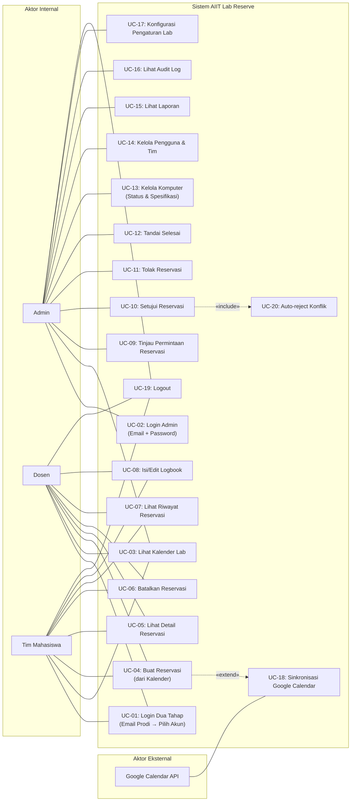
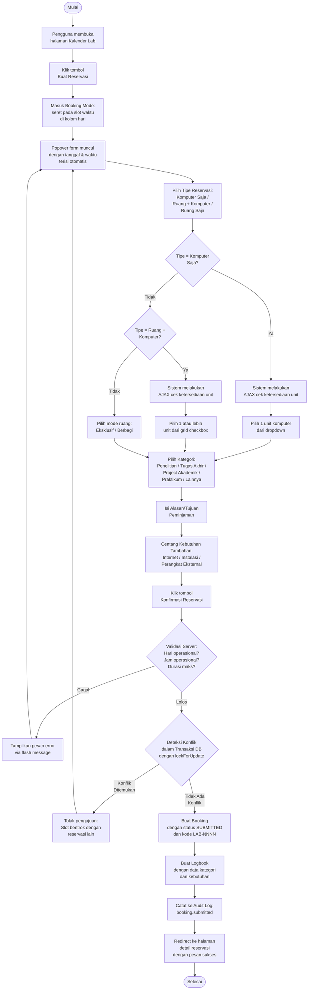
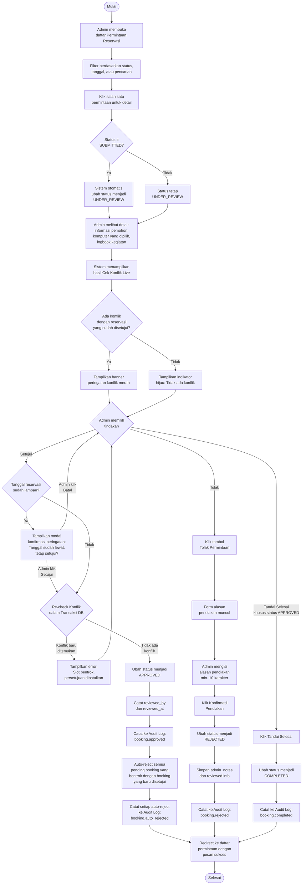
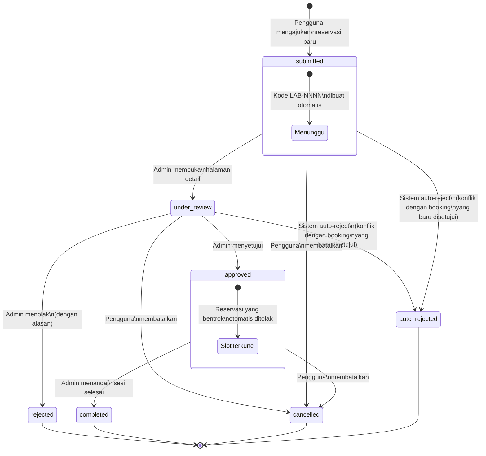

# BAB 3 — ANALISIS DAN PERANCANGAN

## 3.5 Perancangan Proses

Bagian ini menjelaskan alur proses bisnis sistem AIIT Lab Reserve melalui diagram Use Case, diagram Activity/Flowchart, dan diagram State untuk status peminjaman.

---

### 3.5.1 Use Case Diagram

Sistem AIIT Lab Reserve memiliki empat aktor utama:

| Aktor | Deskripsi |
|---|---|
| **Admin** | Administrator laboratorium. Mengelola pengguna, menyetujui/menolak reservasi, mengkonfigurasi pengaturan lab, serta memantau audit log dan laporan. |
| **Dosen** (*Lecturer*) | Tenaga pengajar yang dapat membuat reservasi lab, membatalkan reservasi miliknya, dan mengisi logbook kegiatan. |
| **Tim Mahasiswa** (*Student Team*) | Akun kelompok mahasiswa yang dibimbing oleh dosen PIC. Memiliki hak akses yang sama dengan Dosen dalam hal reservasi. |
| **Google Calendar** | Aktor eksternal (sistem) yang direncanakan untuk sinkronisasi jadwal melalui Google Calendar API. (Tahap pengembangan berikutnya — field `google_event_id` telah disiapkan di database.) |



#### Daftar Use Case dan Pemetaan ke Kebutuhan Fungsional

| Kode UC | Nama Use Case | Aktor | Kebutuhan Fungsional |
|---|---|---|---|
| UC-01 | Login Dua Tahap | Dosen, Tim Mahasiswa | FR-AUTH-01, FR-AUTH-03, FR-AUTH-04, FR-AUTH-06 |
| UC-02 | Login Admin | Admin | FR-AUTH-02, FR-AUTH-03, FR-AUTH-04, FR-AUTH-06 |
| UC-03 | Lihat Kalender Lab | Admin, Dosen, Tim Mahasiswa | FR-CAL-01, FR-CAL-02 |
| UC-04 | Buat Reservasi | Dosen, Tim Mahasiswa | FR-CAL-03, FR-CAL-04, FR-CAL-05, FR-CAL-06, FR-CAL-07, FR-CAL-08 |
| UC-05 | Lihat Detail Reservasi | Dosen, Tim Mahasiswa | FR-BKG-01 |
| UC-06 | Batalkan Reservasi | Dosen, Tim Mahasiswa | FR-BKG-04 |
| UC-07 | Lihat Riwayat Reservasi | Dosen, Tim Mahasiswa | FR-BKG-02, FR-BKG-03 |
| UC-08 | Isi/Edit Logbook | Dosen, Tim Mahasiswa | FR-LOG-01 s.d. FR-LOG-05 |
| UC-09 | Tinjau Permintaan Reservasi | Admin | FR-REQ-01, FR-REQ-02, FR-REQ-03 |
| UC-10 | Setujui Reservasi | Admin | FR-REQ-04, FR-REQ-05, FR-REQ-06 |
| UC-11 | Tolak Reservasi | Admin | FR-REQ-07 |
| UC-12 | Tandai Selesai | Admin | FR-REQ-08 |
| UC-13 | Kelola Komputer | Admin | FR-CMP-01 s.d. FR-CMP-04 |
| UC-14 | Kelola Pengguna & Tim | Admin | FR-USR-01 s.d. FR-USR-06 |
| UC-15 | Lihat Laporan | Admin | FR-RPT-01, FR-RPT-02 |
| UC-16 | Lihat Audit Log | Admin | FR-AUD-01 s.d. FR-AUD-05 |
| UC-17 | Konfigurasi Pengaturan Lab | Admin | FR-SET-01 s.d. FR-SET-03 |
| UC-18 | Sinkronisasi Google Calendar | Google Calendar (eksternal) | CON-03 (direncanakan) |
| UC-19 | Logout | Admin, Dosen, Tim Mahasiswa | FR-AUTH-05 |
| UC-20 | Auto-reject Konflik | Sistem (otomatis) | FR-REQ-06 |

---

### 3.5.2 Diagram Aktivitas / Flowchart

#### A. Alur Pengajuan Peminjaman Lab (Booking Submission Flow)

Diagram berikut menggambarkan proses seorang Dosen atau Tim Mahasiswa mengajukan reservasi melalui kalender interaktif, termasuk titik keputusan deteksi konflik.



**Penjelasan Titik Keputusan Deteksi Konflik:**

Deteksi konflik dilakukan di dalam transaksi database dengan mekanisme `lockForUpdate` untuk mencegah *race condition*. Sistem memeriksa apakah terdapat reservasi lain yang telah disetujui pada slot waktu yang sama (dengan memperhitungkan *buffer* 15 menit) berdasarkan matriks kompatibilitas tipe reservasi:

- **Komputer Saja vs Komputer Saja**: Konflik hanya jika unit PC yang sama dipilih.
- **Ruang + Komputer** atau **Ruang Eksklusif**: Konflik dengan semua tipe pada slot yang sama.
- **Ruang Berbagi vs Komputer Saja**: Tidak konflik (dapat berjalan bersamaan).
- **Ruang Berbagi vs Ruang Berbagi**: Tidak konflik.

---

#### B. Alur Peninjauan dan Persetujuan Admin (Admin Review/Approval Flow)

Diagram berikut menggambarkan proses admin meninjau dan memproses permintaan reservasi, termasuk mekanisme *auto-reject* dan *soft guard* untuk tanggal lampau.



---

### 3.5.3 Diagram Status Peminjaman (Booking Status State Diagram)

Sistem AIIT Lab Reserve menerapkan **tujuh status** untuk setiap reservasi. Perancangan *state machine* ini merupakan elemen kunci dari logika bisnis sistem, yang mengatur transisi status secara ketat untuk menjamin integritas data dan akuntabilitas.

#### Daftar Status

| No | Status | Kode | Deskripsi |
|---|---|---|---|
| 1 | **Diajukan** | `submitted` | Reservasi baru diajukan oleh pengguna dan belum ditinjau oleh admin. |
| 2 | **Sedang Ditinjau** | `under_review` | Admin telah membuka halaman detail reservasi ini — transisi otomatis dari `submitted`. |
| 3 | **Disetujui** | `approved` | Admin telah menyetujui reservasi. Slot waktu terkunci dan konflik dengan permintaan lain yang masih menunggu akan otomatis ditolak. |
| 4 | **Ditolak** | `rejected` | Admin menolak reservasi dengan menyertakan alasan penolakan. |
| 5 | **Selesai** | `completed` | Sesi telah berakhir dan admin menandai reservasi sebagai selesai. |
| 6 | **Dibatalkan** | `cancelled` | Pengguna membatalkan reservasi miliknya sendiri (dapat dilakukan selama status masih `submitted`, `under_review`, atau `approved`). |
| 7 | **Auto-ditolak** | `auto_rejected` | Sistem secara otomatis menolak reservasi yang menunggu karena terjadi konflik setelah reservasi lain disetujui pada slot yang sama. |

#### Diagram State



#### Matriks Transisi Status

Tabel berikut merangkum seluruh transisi status yang diizinkan beserta pemicu dan aktor yang bertanggung jawab:

| Dari | Ke | Pemicu | Aktor |
|---|---|---|---|
| — | `submitted` | Pengguna mengirim form reservasi dari kalender | Dosen / Tim Mahasiswa |
| `submitted` | `under_review` | Admin membuka halaman detail reservasi | Sistem (otomatis) |
| `submitted` | `cancelled` | Pengguna klik Batalkan pada reservasi miliknya | Dosen / Tim Mahasiswa |
| `submitted` | `auto_rejected` | Reservasi lain disetujui pada slot yang sama | Sistem (otomatis) |
| `under_review` | `approved` | Admin klik Setujui (setelah re-check konflik) | Admin |
| `under_review` | `rejected` | Admin klik Tolak dengan mengisi alasan | Admin |
| `under_review` | `cancelled` | Pengguna klik Batalkan pada reservasi miliknya | Dosen / Tim Mahasiswa |
| `under_review` | `auto_rejected` | Reservasi lain disetujui pada slot yang sama | Sistem (otomatis) |
| `approved` | `completed` | Admin klik Tandai Selesai setelah sesi berakhir | Admin |
| `approved` | `cancelled` | Pengguna klik Batalkan pada reservasi miliknya | Dosen / Tim Mahasiswa |

#### Pencatatan Audit

Setiap transisi status dicatat dalam tabel `audit_logs` dengan informasi:

- **Aksi**: `booking.submitted`, `booking.approved`, `booking.rejected`, `booking.auto_rejected`, `booking.cancelled`, `booking.completed`
- **Data sebelum** (*old_values*): status sebelum transisi
- **Data sesudah** (*new_values*): status setelah transisi, termasuk catatan admin (jika ditolak)
- **Aktor**: ID pengguna yang melakukan tindakan (atau `null` untuk aksi otomatis sistem)

---

## 3.6 Perancangan Antarmuka Pengguna (*User Interface Design*)

Antarmuka pengguna AIIT Lab Reserve dirancang dengan pendekatan *modern web design* menggunakan framework Laravel Blade + Alpine.js di sisi frontend dan Tailwind CSS sebagai *utility-first CSS framework*. Desain mengutamakan kesederhanaan, keterbacaan, dan efisiensi alur kerja.

### 3.6.1 Prinsip Desain

| Prinsip | Penerapan |
|---|---|
| **Konsistensi Visual** | Sistem desain terpusat dengan *design tokens* (warna `ink-*`, `mark-*`, `status-*`), tipografi (font *display* dan *body*), serta komponen reusable (badge, card, section, form). |
| **Bahasa Indonesia** | Seluruh label, pesan validasi, status, dan notifikasi menggunakan Bahasa Indonesia sesuai konteks akademik UKRIDA. |
| **Responsif** | Tata letak menggunakan CSS Grid dan Flexbox dengan *breakpoint* mobile-first (`sm`, `lg`). Sidebar menjadi *drawer* pada perangkat mobile. |
| **Feedback Instan** | Flash message (sukses/error) muncul setelah setiap aksi. Badge status menggunakan warna berbeda untuk setiap state. |
| **Navigasi Kontekstual** | Sidebar menampilkan menu berbeda untuk Admin dan Dosen/Tim. Badge notifikasi dinamis menunjukkan jumlah permintaan yang menunggu. |

### 3.6.2 Struktur Tata Letak

Aplikasi menggunakan tata letak *sidebar + content area* yang konsisten di seluruh halaman:

```
┌──────────────────────────────────────────────────────────┐
│  SIDEBAR (256px)  │           CONTENT AREA               │
│                   │                                       │
│  ┌─────────────┐  │  ┌─────────────────────────────────┐  │
│  │  Logo/Brand │  │  │  PAGE HEADER                    │  │
│  │  "UKRIDA    │  │  │  Eyebrow · Title · Actions      │  │
│  │  Lab Reserve"│  │  └─────────────────────────────────┘  │
│  ├─────────────┤  │                                       │
│  │  Navigation │  │  ┌─────────────────────────────────┐  │
│  │  · Dashboard│  │  │  MAIN CONTENT                   │  │
│  │  · Kalender │  │  │  (cards, tables, forms, dll.)   │  │
│  │  · Riwayat  │  │  │                                 │  │
│  │  [atau menu │  │  │                                 │  │
│  │   admin]    │  │  │                                 │  │
│  ├─────────────┤  │  │                                 │  │
│  │  User Menu  │  │  └─────────────────────────────────┘  │
│  │  Nama · Role│  │                                       │
│  │  [Logout]   │  │                                       │
│  └─────────────┘  │                                       │
└──────────────────────────────────────────────────────────┘
```

### 3.6.3 Daftar Halaman dan Komponen Utama

#### A. Halaman Pengguna (Dosen / Tim Mahasiswa)

| No | Halaman | Rute | Deskripsi |
|---|---|---|---|
| 1 | **Login Tahap 1** | `/login` | Form email program studi dengan validasi sisi klien. |
| 2 | **Login Tahap 2** | `/login/select-user` | Dropdown pemilihan akun pengguna dalam program studi. |
| 3 | **Dashboard** | `/dashboard` | 4 kartu statistik (sesi mendatang, total bulan ini, menunggu, total jam), CTA kalender, tabel reservasi dengan tab Mendatang/Selesai, panel info jam operasional & status komputer. |
| 4 | **Kalender Lab** | `/calendar` | Kalender *week-view* interaktif dengan event berwarna, mode *drag-to-book*, popover form reservasi. |
| 5 | **Riwayat Reservasi** | `/booking/history` | Tabel paginasi dengan filter status, tanggal, dan pencarian. |
| 6 | **Detail Reservasi** | `/booking/{id}` | Kartu detail lengkap: kode, tipe, jadwal, komputer, logbook, status, catatan admin. |

#### B. Halaman Admin

| No | Halaman | Rute | Deskripsi |
|---|---|---|---|
| 1 | **Login Admin** | `/admin/login` | Form email + password langsung. |
| 2 | **Dashboard Admin** | `/admin/dashboard` | Statistik ringkas, tabel permintaan aktif, aktivitas terbaru. |
| 3 | **Daftar Permintaan** | `/admin/requests` | Tabel paginasi dengan filter status/tanggal/pencarian, badge jumlah pending. |
| 4 | **Detail Permintaan** | `/admin/requests/{id}` | Layout dua kolom: kiri (info reservasi, grid komputer, logbook, hasil tinjauan) dan kanan (cek konflik, panel setujui dengan modal konfirmasi tanggal lampau, panel tolak dengan form alasan, tombol tandai selesai). |
| 5 | **Kelola Komputer** | `/admin/computers` | Grid komputer dengan status online/maintenance/offline, form edit status dan spesifikasi. |
| 6 | **Kelola Pengguna & Tim** | `/admin/users` | Tabel paginasi, form buat/edit dosen, form buat/edit tim dengan daftar anggota dinamis. |
| 7 | **Laporan** | `/admin/reports` | Pemilihan rentang tanggal, visualisasi CSS bar untuk statistik peminjaman. |
| 8 | **Audit Log** | `/admin/audit-log` | Timeline audit dengan filter aksi, aktor, tanggal, dan pencarian. |
| 9 | **Pengaturan Lab** | `/admin/settings` | Form konfigurasi: nama lab, email admin, jam operasional, hari operasional, durasi maks, buffer. |

### 3.6.4 Komponen Antarmuka Kunci

#### Popover Reservasi Baru (Kalender)

Popover ini muncul saat pengguna melakukan *drag* pada slot waktu di kalender. Komponen ini dirancang untuk menyelesaikan seluruh proses pembuatan reservasi dalam satu langkah tanpa perpindahan halaman.

```
┌─────────────────────────────────────┐
│  Reservasi Baru                     │
│                                     │
│  TANGGAL                            │
│  ┌─ 📅 Senin, 23 Juni 2026 ──────┐ │
│  └────────────────────────────────┘ │
│                                     │
│  WAKTU MULAI        WAKTU SELESAI   │
│  ┌──────────┐       ┌──────────┐    │
│  │ 10:00  ▼ │       │ 12:00  ▼ │    │
│  └──────────┘       └──────────┘    │
│                                     │
│  ⚠ Banner Peringatan (jika ada)     │
│                                     │
│  TIPE RESERVASI                     │
│  ┌ ■ Komputer Saja ─────── [PC] ┐  │
│  ┌ ■ Ruang + Komputer ── [R+PC] ┐  │
│  ┌ ■ Ruang Saja ──────── [ROOM] ┐  │
│                                     │
│  [Pilihan unit / mode ruang]        │
│                                     │
│  KATEGORI                           │
│  ┌─ Penelitian ───────────────▼──┐  │
│  └───────────────────────────────┘  │
│                                     │
│  ALASAN / TUJUAN                    │
│  ┌─ Tujuan peminjaman… ─────────┐  │
│  └───────────────────────────────┘  │
│                                     │
│  KEBUTUHAN TAMBAHAN                 │
│  ☐ Akses Internet                   │
│  ☐ Instalasi Software               │
│  ☐ Perangkat Eksternal              │
│                                     │
│           [Batal]  [Konfirmasi]     │
└─────────────────────────────────────┘
```

#### Panel Persetujuan Admin (Halaman Detail Permintaan)

Panel kanan pada halaman detail permintaan menampilkan informasi cek konflik dan aksi admin:

```
┌─────────────────────────────┐
│  CEK KONFLIK                │
│  ┌─────────────────────────┐│
│  │ ✓ Tidak ada konflik     ││
│  │   jadwal                ││
│  └─────────────────────────┘│
│  Slot 23 Jun 2026 ·        │
│  10:00–12:00 masih kosong.  │
│                             │
│  SETUJUI                    │
│  ┌─────────────────────────┐│
│  │ ⚠ Tanggal sudah lewat  ││ ← (jika tanggal lampau)
│  │ Anda masih dapat        ││
│  │ menyetujui dengan       ││
│  │ konfirmasi.             ││
│  └─────────────────────────┘│
│  [  ✓ Setujui Permintaan  ]│
│                             │
│  TOLAK                      │
│  [ ✗ Tolak Permintaan ]     │
│  ┌─────────────────────────┐│
│  │ Alasan penolakan…       ││ ← (muncul setelah klik)
│  └─────────────────────────┘│
│  [ Konfirmasi Penolakan ]   │
└─────────────────────────────┘
```

### 3.6.5 Skema Warna dan Kode Visual

Sistem menggunakan palet warna yang konsisten untuk menyampaikan informasi status secara visual:

| Elemen | Warna | Kode | Konteks |
|---|---|---|---|
| Status: Diajukan | Biru | `#3B82F6` | Badge status `submitted` |
| Status: Ditinjau | Ungu | `#8B5CF6` | Badge status `under_review` |
| Status: Disetujui | Hijau | `#22C55E` | Badge status `approved` |
| Status: Ditolak | Merah | `#EF4444` | Badge status `rejected` |
| Status: Selesai | Abu-abu | `#6B7280` | Badge status `completed` |
| Status: Dibatalkan | Abu-abu muda | `#9CA3AF` | Badge status `cancelled` |
| Tipe: Komputer | Indigo | `#4F46E5` | Event kalender dan badge |
| Tipe: Ruang + Komputer | Violet | `#7C3AED` | Event kalender dan badge |
| Tipe: Ruang Eksklusif | Teal | `#0D9488` | Event kalender dan badge |
| Tipe: Ruang Berbagi | Amber | `#D97706` | Event kalender dan badge |
| Aksen utama (CTA) | Kuning | `#F5B800` | Tombol aksi utama (`mark-500`) |
| Teks utama | Biru tua | `#0A1A47` | Teks heading dan konten (`ink-900`) |
| Komputer: Tersedia | Hijau teal | `#2EB8A0` | Dot status komputer |
| Komputer: Perawatan | Kuning | `#F5B800` | Dot status komputer |

### 3.6.6 Teknologi Frontend

| Teknologi | Peran |
|---|---|
| **Laravel Blade** | Template engine untuk rendering server-side. Menggunakan komponen reusable (`x-app-layout`, `x-badge`, `x-section`, `x-page-header`, dll.). |
| **Alpine.js** | Reactive UI ringan untuk interaksi sisi klien tanpa full SPA framework. Digunakan pada kalender, popover form, modal, dan toggle sidebar. |
| **Tailwind CSS** | Utility-first CSS framework dengan konfigurasi *design tokens* kustom (`ink`, `mark`, `status`, `rule`). |
| **Vite** | Bundler modern untuk kompilasi CSS dan JavaScript di development dan production. |
| **Google Fonts** | Tipografi: *Inter* (body) dan *DM Serif Display* (heading display). |
